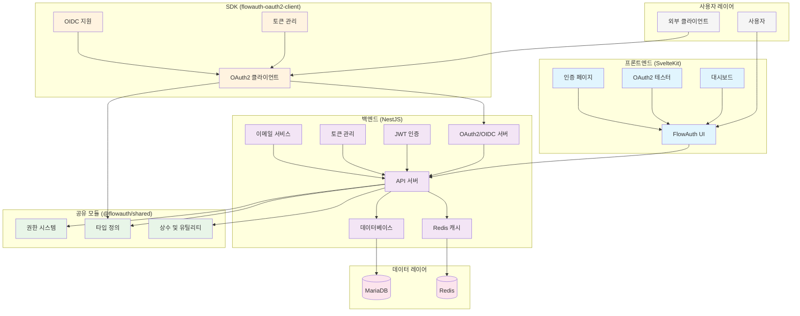

# FlowAuth

FlowAuth는 [OAuth 2.0 표준](https://datatracker.ietf.org/doc/html/rfc6749)과 [OpenID Connect 1.0 표준](https://openid.net/specs/openid-connect-core-1_0.html)을 준수하는 모던한 인증 및 권한 부여 시스템입니다. 외부 서비스 제공자들이 쉽게 애플리케이션을 등록하고 관리할 수 있는 플랫폼을 제공합니다.

## 특징

- **완전한 OAuth2/OIDC 구현**: Authorization Code Grant 플로우 완전 지원 및 OpenID Connect 1.0 표준 준수
- **표준 준수**: OAuth2 RFC 6749 및 OpenID Connect Core 1.0 표준 완전 준수
- **모던한 아키텍처**: NestJS (백엔드) + SvelteKit (프론트엔드)
- **심플 & 모던 UI/UX**: 직관적이고 아름다운 사용자 인터페이스
- **개발자 친화적**: OAuth2/OIDC 테스터 및 완전한 대시보드 제공
- **유연한 서비스 등록**: 외부 개발자들이 쉽게 애플리케이션 등록 가능
- **세밀한 권한 제어**: Scope 기반 권한 관리 시스템
- **TypeORM 통합**: 효율적인 데이터베이스 관리
- **TypeScript 지원**: 타입 안전성과 개발 생산 생산성 향상
- **완전한 토큰 관리**: 액세스/리프레시 토큰 생성, 조회, 취소
- **PKCE 지원**: Proof Key for Code Exchange 보안 강화
- **Docker 지원**: 완전한 컨테이너화된 개발/배포 환경
- **2단계 인증 (2FA)**: TOTP 기반 보안 강화
- **reCAPTCHA v3 통합**: 봇 공격 방지를 위한 Google reCAPTCHA v3 지원
- **사용자 유형 분리**: 일반 사용자와 개발자 역할 구분
- **맞춤형 대시보드**: 사용자 유형별 최적화된 인터페이스
- **역할 기반 접근 제어**: 세밀한 권한 관리 시스템
- **OAuth2/OIDC 클라이언트 SDK**: 외부 개발자들이 쉽게 통합할 수 있는 SDK 제공
- **공유 모듈 아키텍처**: 프론트엔드와 백엔드 간 중앙화된 권한 및 유틸리티 공유
- **Redis 캐싱**: 고성능 분산 캐싱으로 성능 최적화
- **구조화된 로깅**: Winston 기반 보안 이벤트 및 감사 로그

## 아키텍처 개요

## 서브모듈 역할

### Backend (NestJS)

- **OAuth2/OIDC 서버**: 완전한 인증 및 권한 부여 구현
- **JWT 토큰 관리**: 액세스/리프레시 토큰 생성, 검증, 취소
- **데이터베이스 통합**: TypeORM을 통한 MariaDB 연동
- **Redis 캐싱**: 고성능 데이터 캐싱 및 세션 관리
- **이메일 서비스**: SMTP 기반 이메일 인증 및 알림
- **보안 기능**: 2FA, reCAPTCHA, 헬멧, CORS, 레이트 리미팅
- **API 문서**: Swagger/OpenAPI 자동 생성

### Frontend (SvelteKit)

- **모던 UI/UX**: 직관적인 사용자 인터페이스
- **대시보드**: 클라이언트 관리, 토큰 관리, 통계
- **OAuth2 테스터**: 개발자용 인증 플로우 테스트 도구
- **반응형 디자인**: TailwindCSS 기반 모바일 친화적 UI
- **컴포넌트 라이브러리**: 재사용 가능한 UI 컴포넌트

### Shared (@flowauth/shared)

- **권한 시스템**: 비트마스크 기반 RBAC (역할 기반 접근 제어)
- **타입 안전성**: TypeScript 타입 정의 공유
- **상수 및 유틸리티**: JWT, 인증, 권한 관련 공통 코드
- **권한 유틸리티**: 권한 검증 및 역할 관리 헬퍼 함수

### SDK (flowauth-oauth2-client)

- **OAuth2/OIDC 클라이언트**: 외부 애플리케이션 통합용 SDK
- **PKCE 지원**: 보안 강화된 인증 플로우
- **토큰 자동 관리**: 자동 리프래시 및 저장
- **다중 환경 지원**: 브라우저 및 Node.js 호환
- **타입 안전**: TypeScript enum을 통한 스코프 관리

## 기술 스택

| 컴포넌트     | 기술                     | 설명                         |
| ------------ | ------------------------ | ---------------------------- |
| **Backend**  | NestJS, TypeORM, MariaDB | API 서버 및 데이터베이스     |
| **Frontend** | SvelteKit, TailwindCSS   | 사용자 인터페이스            |
| **Shared**   | TypeScript               | 공통 타입 및 유틸리티        |
| **SDK**      | TypeScript               | OAuth2 클라이언트 라이브러리 |
| **Database** | MariaDB                  | 관계형 데이터 저장           |
| **Cache**    | Redis                    | 고성능 캐싱 및 세션          |
| **Queue**    | Bull (Redis)             | 이메일 및 백그라운드 작업    |
| **Security** | JWT, bcrypt, RSA         | 인증 및 암호화               |

## 데이터 흐름

1. **사용자 인증**: 프론트엔드 → 백엔드 → 데이터베이스
2. **토큰 발급**: OAuth2 플로우 → JWT 생성 → Redis 캐시
3. **API 접근**: 클라이언트 → SDK → 백엔드 API → 권한 검증
4. **데이터 조회**: 백엔드 → TypeORM → MariaDB
5. **캐시 활용**: 빈번한 조회 → Redis → 빠른 응답
6. **이메일 발송**: 이벤트 발생 → Bull 큐 → SMTP 서버

## 개발 & 배포

개발과 배포와 관련된 자세한 내용은 이 리포지토리의 각 서브모듈(프론트엔드, 백엔드, 공유모듈, SDK)의 README 파일을 참고하세요.

## 라이선스

이 프로젝트는 MIT 라이선스 하에 있습니다.
