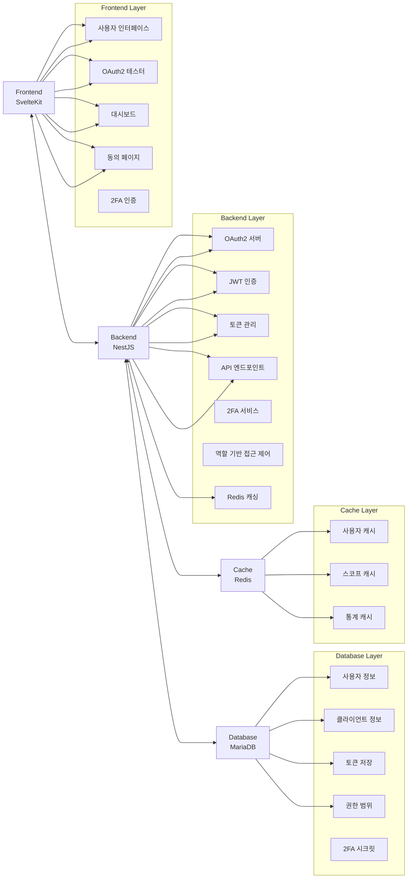

# FlowAuth

> [!NOTE]
> 이 프로젝트는 아직 개발 중인 미완성 상태입니다. 많은 기능이 추가될 예정이며, 누구나 자유롭게 기여하실 수 있습니다!


FlowAuth는 [OAuth 2.0 표준](https://datatracker.ietf.org/doc/html/rfc6749)을 준수하는 모던한 인증 및 권한 부여 시스템입니다. 외부 서비스 제공자들이 쉽게 애플리케이션을 등록하고 관리할 수 있는 플랫폼을 제공합니다.

## 🚀 특징

- **완전한 OAuth2 구현**: Authorization Code Grant 플로우 완전 지원
- **표준 준수**: OAuth2 RFC 6749 표준 완전 준수
- **모던한 아키텍처**: NestJS (백엔드) + SvelteKit (프론트엔드)
- **심플 & 모던 UI/UX**: 직관적이고 아름다운 사용자 인터페이스
- **개발자 친화적**: OAuth2 테스터 및 완전한 대시보드 제공
- **유연한 서비스 등록**: 외부 개발자들이 쉽게 애플리케이션 등록 가능
- **세밀한 권한 제어**: Scope 기반 권한 관리 시스템
- **TypeORM 통합**: 효율적인 데이터베이스 관리
- **TypeScript 지원**: 타입 안전성과 개발 생산성 향상
- **완전한 토큰 관리**: 액세스/리프레시 토큰 생성, 조회, 취소
- **PKCE 지원**: Proof Key for Code Exchange 보안 강화
- **Docker 지원**: 완전한 컨테이너화된 개발/배포 환경
- **2단계 인증 (2FA)**: TOTP 기반 보안 강화
- **reCAPTCHA v3 통합**: 봇 공격 방지를 위한 Google reCAPTCHA v3 지원
- **사용자 유형 분리**: 일반 사용자와 개발자 역할 구분
- **맞춤형 대시보드**: 사용자 유형별 최적화된 인터페이스
- **역할 기반 접근 제어**: 세밀한 권한 관리 시스템
- **Redis 캐싱**: 고성능 분산 캐싱으로 성능 최적화
- **구조화된 로깅**: Winston 기반 보안 이벤트 및 감사 로그

## 🏗️ 아키텍처 개요



## 📋 시스템 요구사항

- **Node.js**: v18 이상
- **MariaDB**: 최신 버전 (또는 MySQL 8.0 이상)
- **Redis**: 최신 버전 (권장: 7.x)
- **npm** 또는 **yarn**
- **Git**: 서브모듈 지원

## Docker를 이용한 빠른 시작

Docker를 사용하면 모든 의존성과 함께 완전한 개발 환경을 쉽게 구축할 수 있습니다.

### 1. 환경 설정

```bash
# 프로젝트 클론
git clone --recursive https://github.com/vientofactory/FlowAuth.git
cd FlowAuth

# 환경 변수 설정
cp .env.example .env
# .env 파일을 열어서 데이터베이스 비밀번호 등을 설정하세요
```

### 2. Docker Compose로 실행

```bash
# 모든 서비스 시작 (백엔드, 프론트엔드, 데이터베이스)
docker-compose up -d

# 또는 개발 모드로 실행 (소스 코드 실시간 반영)
docker-compose -f docker-compose.yml -f docker-compose.override.yml up -d
```

#### 🚀 시작 순서

Docker Compose는 다음과 같은 순서로 서비스를 시작합니다:

1. **DB (MariaDB)** → 데이터베이스 초기화 및 준비
2. **Redis** → 캐시 서버 초기화 및 준비
3. **Backend (NestJS)** → DB와 Redis가 준비될 때까지 대기 후 시작
4. **Frontend (SvelteKit)** → Backend가 준비될 때까지 대기 후 시작

각 서비스는 healthcheck를 통해 이전 서비스가 완전히 준비되었는지 확인한 후 시작됩니다.

### 3. 서비스 접속

- **프론트엔드**: http://localhost:4173 (또는 개발 모드: http://localhost:5173)
- **백엔드 API**: http://localhost:3000
- **API 문서**: http://localhost:3000/api
- **Redis**: localhost:6379 (Docker 컨테이너 내부에서만 접근 가능)

### 4. 로그 확인

```bash
# 모든 서비스 로그
docker-compose logs -f

# 특정 서비스 로그
docker-compose logs -f backend
docker-compose logs -f frontend
docker-compose logs -f redis
```

### 5. 서비스 중지

```bash
# 모든 서비스 중지 및 제거
docker-compose down

# 볼륨까지 제거 (데이터 초기화)
docker-compose down -v
```

## 🛠️ 수동 설치 (Docker 미사용)

1. **프로젝트 클론** (서브모듈 포함):

   ```bash
   git clone --recursive https://github.com/vientofactory/FlowAuth.git
   cd FlowAuth
   ```

2. **Redis 설치 및 실행**:

   ```bash
   # macOS (Homebrew)
   brew install redis
   brew services start redis

   # Ubuntu/Debian
   sudo apt update
   sudo apt install redis-server
   sudo systemctl start redis-server

   # 또는 Docker로 실행
   docker run -d -p 6379:6379 --name redis redis:7-alpine
   ```

3. **백엔드 실행**:

   ```bash
   cd backend
   npm install
   cp .env.example .env  # 환경 변수 설정
   npm run start:dev
   ```

4. **프론트엔드 실행** (새 터미널에서):

   ```bash
   cd frontend
   npm install
   npm run dev
   ```

5. **브라우저에서 접속**:
   - 프론트엔드: http://localhost:5173
   - 백엔드 API: http://localhost:3000
   - API 문서: http://localhost:3000/api

## 📁 프로젝트 구조

```
FlowAuth/
├── backend/              # NestJS 백엔드 애플리케이션
│   ├── src/
│   │   ├── auth/         # JWT 인증 모듈
│   │   ├── oauth2/       # OAuth2 핵심 구현
│   │   ├── cache/        # Redis 캐시 설정
│   │   ├── user/         # 사용자 엔티티 및 서비스
│   │   ├── client/       # OAuth2 클라이언트 엔티티
│   │   ├── token/        # 토큰 엔티티 및 관리
│   │   ├── scope/        # 권한 범위 엔티티
│   │   ├── authorization-code/  # 인가 코드 엔티티
│   │   ├── database/     # 데이터베이스 설정 및 시딩
│   │   ├── migrations/   # 데이터베이스 마이그레이션
│   │   └── utils/        # 유틸리티 (암호화, ID 생성 등)
│   └── ...
├── frontend/             # SvelteKit 프론트엔드 애플리케이션
│   ├── src/
│   │   ├── routes/       # 페이지 라우트
│   │   │   ├── auth/     # 로그인/회원가입 페이지
│   │   │   ├── dashboard/  # 사용자 대시보드
│   │   │   ├── oauth/    # OAuth2 동의 페이지
│   │   │   └── callback/ # OAuth2 콜백 페이지
│   │   ├── lib/          # 재사용 가능한 컴포넌트
│   │   │   ├── components/  # UI 컴포넌트
│   │   │   ├── stores/   # Svelte 스토어
│   │   │   ├── types/    # TypeScript 타입 정의
│   │   │   └── utils/    # 유틸리티 함수
│   │   └── ...
│   └── ...
├── .gitmodules           # Git 서브모듈 설정
└── README.md
```

## ⚙️ 환경 설정

### 백엔드 (.env 파일)

```env
# 데이터베이스 설정
DB_HOST=localhost
DB_PORT=3306
DB_USERNAME=root
DB_PASSWORD=your_password
DB_NAME=flowauth

# 애플리케이션 설정
PORT=3000
NODE_ENV=development

# JWT 설정
JWT_SECRET=your_super_secret_jwt_key_here
JWT_EXPIRES_IN=1h

# 보안 설정
BCRYPT_SALT_ROUNDS=10

# Redis 캐시 설정
REDIS_HOST=localhost
REDIS_PORT=6379
REDIS_PASSWORD=

# reCAPTCHA 설정 (선택사항)
RECAPTCHA_SECRET_KEY=your_recaptcha_secret_key_here
```

### 프론트엔드 (.env 파일)

```env
# API 서버 설정
VITE_API_BASE_URL=http://localhost:3000

# reCAPTCHA 설정 (선택사항)
VITE_RECAPTCHA_SITE_KEY=your_recaptcha_site_key_here
```

### 데이터베이스 초기화

```bash
# 백엔드에서 마이그레이션 실행
cd backend
npm run migration:run
```

### 데이터베이스 테이블 구조

FlowAuth는 다음과 같은 5개의 주요 테이블을 사용합니다:

#### 📋 테이블 개요

| 테이블               | 설명                 | 주요 필드                                                          |
| -------------------- | -------------------- | ------------------------------------------------------------------ |
| `user`               | 사용자 정보          | id, username, email, password, permissions, 2FA 설정               |
| `client`             | OAuth2 클라이언트    | id, clientId, clientSecret, redirectUris, grants, scopes           |
| `token`              | 액세스/리프레시 토큰 | id, accessToken, refreshToken, expiresAt, scopes, user/client 관계 |
| `authorization_code` | OAuth2 인가 코드     | id, code, expiresAt, scopes, user/client 관계                      |
| `scope`              | 권한 범위            | id, name, description, isDefault, isActive                         |

#### 🔗 테이블 관계

```
user (1) ──── (N) client
  │                │
  └─── (N) token ──┘
       │
       └─── (N) authorization_code
```

#### 📝 수동 테이블 생성 SQL

TypeORM 마이그레이션을 사용하지 않고 수동으로 테이블을 생성하려면 [백엔드 README의 데이터베이스 설정 섹션](./backend/README.md#수동-테이블-생성-선택사항)을 참조하세요.

## 🔧 개발 가이드

## reCAPTCHA 설정 (선택사항)

FlowAuth는 Google reCAPTCHA v3를 지원하여 봇 공격으로부터 인증 시스템을 보호합니다.

### 1. Google reCAPTCHA 콘솔에서 키 발급

1. [Google reCAPTCHA 콘솔](https://www.google.com/recaptcha/admin)로 이동
2. "Create" 버튼을 클릭하여 새 사이트를 등록
3. reCAPTCHA 유형을 **"v3"**로 선택
4. 도메인을 등록 (로컬 개발 시: `localhost`)
5. 이용약관에 동의하고 제출

### 2. 키 설정

발급받은 키를 환경 변수에 설정:

**백엔드 (.env)**:

```env
RECAPTCHA_SECRET_KEY=your_secret_key_here
```

**프론트엔드 (.env)**:

```env
VITE_RECAPTCHA_SITE_KEY=your_site_key_here
```

### 3. 기능 활성화

환경 변수에 키를 설정하면 자동으로 reCAPTCHA가 활성화됩니다:

- 회원가입 페이지에서 봇 검증
- 로그인 페이지에서 봇 검증
- Footer에 Google 약관 표시

### 4. 테스트 키 (개발용)

개발 환경에서는 Google에서 제공하는 테스트 키를 사용할 수 있습니다:

```env
# 백엔드
RECAPTCHA_SECRET_KEY=6LeIxAcTAAAAAGG-vFI1TnRWxMZNFuojJ4WifJWe

# 프론트엔드
VITE_RECAPTCHA_SITE_KEY=6LeIxAcTAAAAAJcZVRqyHh71UMIEGNQ_MXjiZKhI
```

> ⚠️ **주의**: 테스트 키는 개발 환경에서만 사용하세요. 운영 환경에서는 실제 키를 발급받아 사용해야 합니다.

## 🔧 개발 가이드

### 개발 서버 실행

```bash
# 백엔드 (포트 3000)
cd backend && npm run start:dev

# 프론트엔드 (포트 5173)
cd frontend && npm run dev
```

### 사용 가능한 스크립트

#### 백엔드

```bash
npm run start:dev      # 개발 서버
npm run build         # 프로덕션 빌드
npm run test          # 단위 테스트
npm run lint          # 코드 린팅
```

#### 프론트엔드

```bash
npm run dev           # 개발 서버
npm run build         # 프로덕션 빌드
npm run preview       # 빌드 미리보기
npm run lint          # 코드 린팅
```

## 프로젝트 상태

### ✅ 완료된 기능들

#### 🎨 프론트엔드

- **현대적인 메인 페이지**: 그라데이션 배경과 애니메이션 효과
- **인증 시스템**: 회원가입, 로그인, 프로필 관리 페이지
- **사용자 대시보드**: 완전한 대시보드 UI 및 네비게이션
- **OAuth2 동의 페이지**: 사용자 권한 승인 인터페이스
- **클라이언트 관리**: OAuth2 애플리케이션 등록 및 관리
- **토큰 관리**: 발급된 토큰 조회 및 취소 기능
- **OAuth2 테스터**: 개발자용 OAuth2 플로우 테스트 도구
- **컴포넌트 라이브러리**: Button, Input, Card, Badge, Modal 등 완전한 컴포넌트 시스템
- **TailwindCSS 통합**: 커스텀 디자인 시스템
- **Font Awesome 아이콘**: 모든 아이콘 통합
- **반응형 디자인**: 모바일 우선 접근 방식
- **API 클라이언트**: 타입 안전한 API 통신
- **Toast 알림 시스템**: 사용자 피드백 시스템
- **2단계 인증 (2FA)**: TOTP 기반 보안 로그인
- **사용자 유형별 인터페이스**: 일반 사용자와 개발자 맞춤형 UI
- **동적 대시보드**: 사용자 유형에 따른 통계 및 메뉴 표시
- **역할 기반 네비게이션**: 권한에 따른 메뉴 필터링

#### 🔧 백엔드

- **완전한 OAuth2 구현**: Authorization Code Grant 플로우
- **사용자 관리**: 등록, 로그인, 프로필 관리 API
- **클라이언트 관리**: OAuth2 클라이언트 CRUD 작업
- **토큰 관리**: 액세스 토큰 및 리프레시 토큰 생성/관리
- **권한 범위(Scope) 시스템**: 세밀한 권한 제어
- **인가 코드 관리**: 보안 인가 코드 생성 및 검증
- **JWT 인증**: 안전한 토큰 기반 인증
- **보안 강화**: 헬멧, CORS, 레이트 리미팅 적용
- **데이터베이스**: TypeORM으로 완전한 모델링
- **API 문서화**: Swagger를 통한 자동 문서 생성
- **데이터 시딩**: 개발용 초기 데이터 생성
- **2단계 인증 (2FA)**: TOTP 기반 보안 강화
- **사용자 유형 분리**: 일반 사용자와 개발자 역할 구분
- **역할 기반 액세스 제어 (RBAC)**: 세부적인 권한 관리
- **대시보드 API**: 사용자 유형별 통계 및 데이터 제공

### 🔄 진행 중인 작업

- [ ] 관리자 페이지 개발
- [ ] 사용자 설정 페이지 완성

### 📋 향후 계획

- [ ] 통합 테스트 및 QA
- [x] Docker 컨테이너화
- [ ] CI/CD 파이프라인 구축
- [x] 프로덕션 배포 가이드
- [ ] 성능 최적화
- [ ] 모니터링 및 로깅 시스템

## 배포 가이드

FlowAuth는 Docker를 통한 컨테이너화된 배포를 권장합니다.

### Docker를 이용한 프로덕션 배포

```bash
# 프로덕션용 Docker Compose 실행
docker-compose -f docker-compose.yml -f docker-compose.prod.yml up -d

# 또는 환경 변수로 프로덕션 모드 지정
NODE_ENV=production docker-compose up -d
```

### 수동 배포

#### 백엔드 배포

```bash
cd backend
npm ci --only=production
npm run build
npm run start:prod
```

#### 프론트엔드 배포

```bash
cd frontend
npm ci --only=production
npm run build
node build/index.js
```

### 지원되는 플랫폼

#### 백엔드

- **Railway**: Node.js 애플리케이션으로 배포
- **Render**: Node.js 웹 서비스로 배포
- **Heroku**: Node.js 앱으로 배포
- **DigitalOcean App Platform**: Node.js 앱으로 배포
- **AWS EC2**: 직접 서버 배포
- **PM2**: 프로세스 매니저를 통한 배포

#### 프론트엔드

- **Vercel**: `vercel --prod`
- **Railway**: Node.js 애플리케이션으로 배포
- **Render**: Node.js 웹 서비스로 배포
- **Heroku**: Node.js 앱으로 배포
- **DigitalOcean App Platform**: Node.js 앱으로 배포
- **PM2**: 프로세스 매니저를 통한 배포

### 환경 변수 설정

프로덕션 배포 시 다음 환경 변수를 설정하세요:

```bash
# 데이터베이스
DB_HOST=your-db-host
DB_PORT=3306
DB_USERNAME=your-db-user
DB_PASSWORD=your-db-password
DB_NAME=flowauth

# Redis
REDIS_HOST=your-redis-host
REDIS_PORT=6379
REDIS_PASSWORD=your-redis-password

# JWT
JWT_SECRET=your-jwt-secret
JWT_REFRESH_SECRET=your-jwt-refresh-secret

# OAuth2
OAUTH2_ISSUER=https://your-domain.com
FRONTEND_URL=https://your-frontend-domain.com

# 기타
NODE_ENV=production
PORT=3000
```

## �📚 API 문서

백엔드 서버 실행 후 다음에서 API 문서를 확인할 수 있습니다:

- **Swagger UI**: http://localhost:3000/api

## 🔒 보안 기능

- **JWT 토큰 기반 인증**
- **비밀번호 해싱 (bcrypt)**
- **헬멧 (Helmet) 보안 헤더**
- **CORS 설정**
- **레이트 리미팅**
- **PKCE (Proof Key for Code Exchange) 지원**
- **인가 코드 만료 (환경 변수로 설정 가능)**
- **토큰 만료 관리**
- **2단계 인증 (2FA)**: TOTP 기반 추가 보안 계층
- **역할 기반 액세스 제어 (RBAC)**: 세부적인 권한 관리

## 🤝 기여 가이드

FlowAuth는 모든 개발자의 기여를 환영합니다! 아래 절차에 따라 자유롭게 참여해 주세요.

1. **Fork**: 백엔드 또는 프론트엔드 리포지토리를 자신의 GitHub 계정으로 포크하세요.
   > ⚠️ 이 메인 리포지토리는 서브모듈 관리용입니다. 실제 코드 변경은 각 하위 리포지토리에서 진행해 주세요.
2. **브랜치 생성**: 새로운 기능 또는 버그 수정을 위한 브랜치를 만드세요.
   ```bash
   git checkout -b feature/YourFeatureName
   ```
3. **커밋**: 변경사항을 명확한 메시지와 함께 커밋하세요.
   ```bash
   git commit -m "feat: Your concise commit message"
   ```
4. **푸시**: 작업한 브랜치를 자신의 원격 저장소에 푸시하세요.
   ```bash
   git push origin feature/YourFeatureName
   ```
5. **Pull Request 생성**: GitHub에서 Pull Request를 생성하고, 변경 내용을 설명해 주세요.
6. **리뷰 및 반영**: 리뷰어의 피드백을 반영해 주세요.

## 📞 문의 및 지원

- **이슈**: [GitHub Issues](https://github.com/vientofactory/FlowAuth/issues)
- **토론**: [GitHub Discussions](https://github.com/vientofactory/FlowAuth/discussions)

## Redis 캐싱 시스템

FlowAuth는 고성능을 위해 Redis 기반 분산 캐싱을 구현합니다.

### 캐시되는 데이터

- **사용자 정보**: 프로필, 권한 정보 (TTL: 10분)
- **사용자 권한**: 역할 및 권한 데이터 (TTL: 5분)
- **대시보드 통계**: 사용자 활동 및 통계 데이터 (TTL: 2분)
- **OAuth2 스코프**: 권한 범위 정보 (TTL: 1시간)

### 캐시 키 구조

```
permissions:{userId}     # 사용자 권한
user:{userId}           # 사용자 정보
stats:{userId}          # 대시보드 통계
activities:{userId}:{limit}  # 사용자 활동
scopes:all              # 전체 스코프 목록
scopes:default          # 기본 스코프 목록
scopes:name:{scopeName} # 개별 스코프
```

### 캐시 관리

- **자동 갱신**: 데이터 변경 시 자동으로 캐시 무효화 및 재생성
- **메모리 + Redis**: 이중 캐싱으로 빠른 응답 속도 보장
- **TTL 설정**: 각 데이터 유형별 최적화된 만료 시간
- **에러 복원력**: 캐시 실패 시 데이터베이스에서 직접 조회

### 모니터링

```bash
# Redis 연결 상태 확인
docker-compose exec redis redis-cli ping

# 캐시 키 조회
docker-compose exec redis redis-cli keys "*"

# 메모리 사용량 확인
docker-compose exec redis redis-cli info memory
```

## 라이선스

이 프로젝트는 MIT 라이선스 하에 있습니다.
